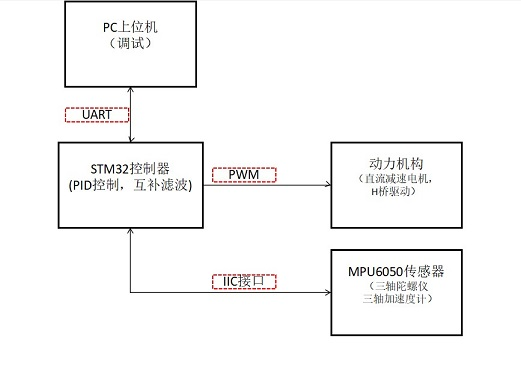
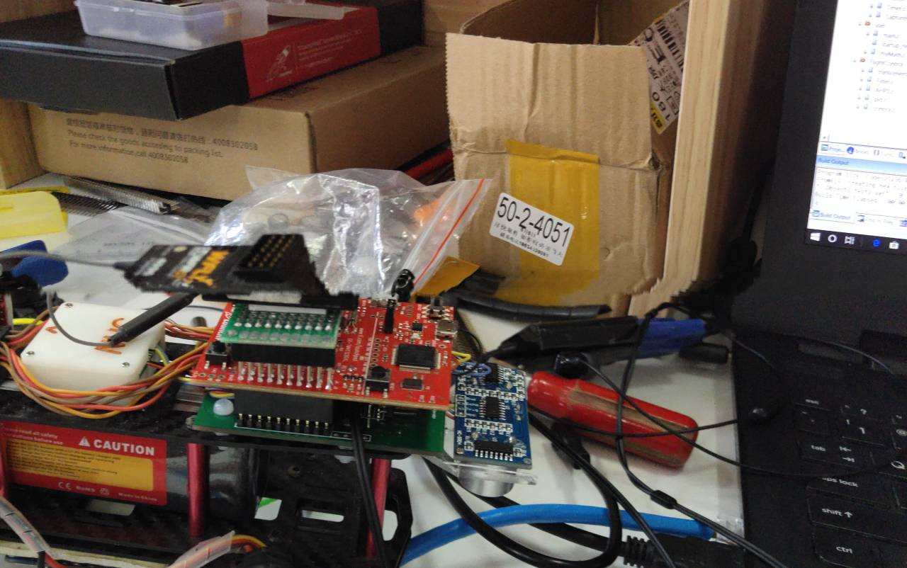
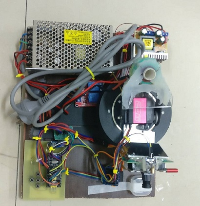
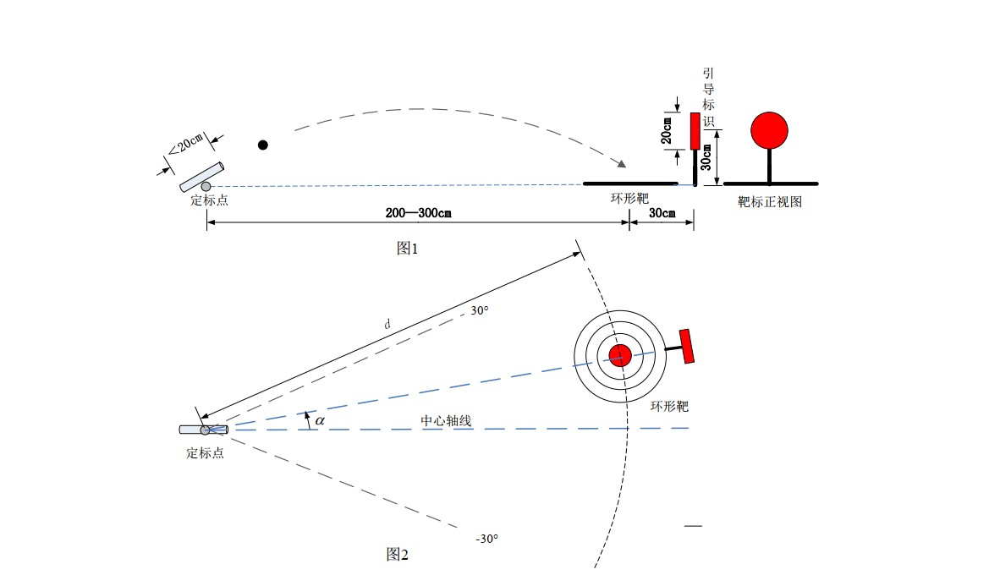

# CV_introduce

关于简历的更多项目介绍

**我折腾过哪些项目？:point_down:**


---------------------------------

#### 1. 平衡小车

展示视频：

<iframe src="//player.bilibili.com/player.html?aid=33811954&cid=59172114&page=1" scrolling="no" border="0" frameborder="no" framespacing="1" allowfullscreen="true"> </iframe>
这是一个简单的制作，主要是了解一下PID控制还有传感器滤波的算法。

> ##### 1.1 项目架构
>
> 
>
> ##### 1.2 软件算法
>
> 关于机械结构，硬件和BSP底层驱动就不介绍了，讲一下算法部分。
>
> 1. pid控制
>
>    本例使用的是角度的位置式pid控制。为了便于调参，自定义了一个串口文本帧用于解析pid参数，这样可以用串口助手方便的调参。
>
> 2. 角度滤波
>
>    角度来源于MPU6050传感器，这是含有一个三轴加速度计，三轴陀螺仪的MEMS器件，由于它比较廉价，存在较大的噪声，零漂，尺度误差，正交误差等问题，需要对原始数据做处理。
>
>    本例使用最简单互补滤波方法：
>
>    ```c++
>    //angle 为当前角度
>    //k 为滤波系数（陀螺仪的置信度）
>    //gyro 为转动轴的角速度
>    //angle_acc 为加速度计解算的角度
>    /* 为了提高精度可以使用高阶的龙格-库塔积分，加速度计和陀螺仪的数据也可以做一下平滑均值滤波 */
>    angle = (k)*(angle + gyro*dt) + (1-k)*angle_acc;
>    
>    ```


#### 2. 四旋翼飞控

四旋翼相当于**平衡车plus**,多了一个要控制的轴，我对飞行控制比较感兴趣于是尝试写飞控。当然像动力学建模，能源与动力系统，定位导航通信等方向都很重要，本项目没有涉及。



其中一个试验飞机:small_red_triangle:


#### 3. 智能开关


#### 4. 电磁炮

这是今年暑假参加2019全国大学生电子设计竞赛的作品，也是大学时代最后的一次比赛。



题目要求做一个由电容供能的电磁炮，可以发射弹丸。炮管架在两轴的云台上可以调节俯仰角可方位角。然后测试打靶精度。

**具体题目：**



1.基本要求
（1） 电磁炮能够将弹丸射出炮口。
（2） 环形靶放置在靶心距离定标点 200~300cm 间，且在中心轴线上的位置处， 键盘输入距离 d 值，电磁炮将弹丸发射至该位置， 距离偏差的绝对值不大于 50cm。
（3） 用键盘给电磁炮输入环形靶中心与定标点的距离 d 及与中心轴线的偏离角度a， 一键启动后， 电磁炮自动瞄准射击， 按击中环形靶环数计分； 若脱靶则不计分。
2.发挥部分
（1） 在指定范围内任意位置放置环形靶（有引导标识，参见说明 2）， 一键启动后， 电磁炮自动搜寻目标并炮击环形靶，按击中环形靶环数计分，完成时间≤30s。
（2） 环形靶与引导标识一同放置在距离定标点 d=250cm 的弧线上（以靶心定位），引导标识处于最远位置。 电磁炮放置在定标点， 炮管水平方向与中轴线夹角a =-30°、仰角 0° 。 一键启动电磁炮，炮管在水平方向与中轴线夹角a从-30° 至 30° 、 再返回-30°做往复转动，在转动过程中（中途不得停顿） 电磁炮自动搜寻目标并炮击环形靶，按击中环形靶环数计分， 启动至击发完成时间≤10s。
（3） 其他。 


**下面是具体方案：**

##### 1 系统架构


